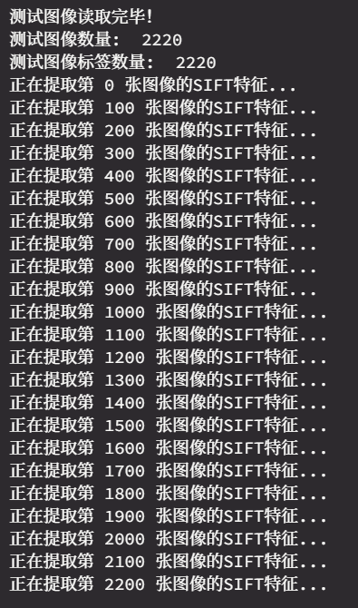

# CV_HW_2 图像分类系统

## 任务

任务：编写一个图像分类系统，能够对输入图像进行类别预测。具体的说，利用数据库的2250张训练样本进行训练；对测试集中的2235张样本进行预测。

数据库说明：scene_categories数据集包含15个类别（文件夹名就是类别名），每个类中编号前150号的样本作为训练样本，15个类一共2250张训练样本；剩下的样本构成测试集合。

使用知识点:**SIFT特征、Kmeans、词袋表示、支撑向量机**

***-----------目录----------***

[TOC]

## Step 0: 导入相关的库

```py
import cv2
import os
import numpy as np
from sklearn.cluster import KMeans
from sklearn.svm import SVC
from sklearn.preprocessing import StandardScaler
import pickle
```

## Step 1: 训练数据处理，提取SIFT特征

### 1-1）读取文件，训练数据处理

```py
def load_images_from_folder(folder):
    images = [] # 存储所有图像
    for filename in os.listdir(folder): # 遍历文件夹中的每个图像
        img = cv2.imread(os.path.join(folder, filename)) # 读取图像
        if img is not None: # 如果图像读取成功
            images.append(img) # 将图像添加到images中
    return images # 返回所有图像
```

该函数用于从指定文件夹加载图像并将其存储在一个列表中。

函数的输入是一个文件夹的路径（`folder`）。它使用了`os`和`cv2`两个Python库来实现图像的读取和操作。

- 代码首先创建了一个空列表`images`，用于存储所有的图像。

- 然后，使用`os.listdir(folder)`遍历指定文件夹中的每个文件名。`os.listdir()`函数返回指定路径中的文件名列表。

- 在每次迭代中，代码使用`cv2.imread()`函数读取图像。`cv2.imread()`函数接受图像文件的完整路径作为输入，并返回一个表示图像的NumPy数组。如果图像读取成功，则`img`变量将保存该图像的NumPy数组。

- 接下来，代码使用条件语句检查`img`是否为`None`，即判断图像是否读取成功。如果图像成功读取，则将其添加到`images`列表中。


最后，函数返回`images`列表，其中包含了从指定文件夹加载的所有图像。

```py
train_images = [] # 存储所有训练图像
train_labels = [] # 存储所有训练图像的标签
for category in os.listdir("./15-Scene"):  
    train_images += load_images_from_folder("./15-Scene/" + category)[:150] # 读取每个类别的前150张图像
    for i in range(150):
        train_labels.append(int(category)) # 将每个类别添加到train_labels中
```

这段代码用于加载训练图像和相应的标签。

- 首先，创建两个空列表`train_images`和`train_labels`，分别用于存储训练图像和对应的标签。

- 然后，使用`os.listdir()`函数遍历位于"./15-Scene"文件夹中的每个文件夹，这些文件夹代表不同的图像类别。

- 对于每个类别，调用`load_images_from_folder()`函数来加载该类别文件夹中的图像。`load_images_from_folder()`函数返回一个图像列表，并使用切片操作`[:150]`只保留每个类别的前150张图像。这些图像被添加到`train_images`列表中。

- 接下来，使用一个循环从0到149，将当前类别的整数表示（通过`int(category)`转换）添加到`train_labels`列表中，以便与每个图像的标签相对应。


最终，`train_images`列表将包含所有训练图像，而`train_labels`列表将包含所有训练图像的标签。

### 1-2）为每个图像提取SIFT特征

```py
def extract_sift_features(X):
    image_descriptors = [] # 存储所有图像的SIFT特征
    sift = cv2.SIFT_create()  # 创建SIFT对象
    for i in range(len(X)): # 提取每张图像的SIFT特征
        if i % 100 == 0:
            print("正在提取第", i, "张图像的SIFT特征...")
        kp, des = sift.detectAndCompute(X[i], None) # kp为关键点，des为描述子
        image_descriptors.append(des) # 将每张图像的描述子添加到image_descriptors中
    return image_descriptors # 返回所有图像的SIFT特征
train_descriptors = extract_sift_features(train_images)
```

函数`extract_sift_features()`用于提取图像的SIFT（尺度不变特征变换）特征。

函数的输入参数是一个图像列表`X`。

- 首先创建一个空列表`image_descriptors`，用于存储所有图像的SIFT特征。接下来，使用`cv2.SIFT_create()`创建了一个SIFT对象`sift`，用于提取SIFT特征。

- 然后，通过一个循环遍历图像列表`X`中的每张图像。对于每张图像，代码使用`sift.detectAndCompute()`函数提取关键点（`kp`）和描述子（`des`）。其中，关键点表示图像中具有显著特征的位置，描述子是用于表示关键点周围局部图像区域的特征向量。

- 在每个循环迭代中，代码将当前图像的描述子`des`添加到`image_descriptors`列表中。

- 同时，代码在每处理100张图像时打印一条提示信息，指示当前正在提取的图像编号。

- 最后，函数返回`image_descriptors`列表，其中包含了所有图像的SIFT特征。


最后调用`extract_sift_features()`函数，并将`train_images`作为参数传递给它，将返回的SIFT特征存储在`train_descriptors`变量中。


### 1-3）将所有描述子垂直堆积在一个numpy数组中

```py
descriptors_list = list(train_descriptors[0])  # 将第一个描述子转换为列表
for descriptor in train_descriptors[1:]:  # 从第二个描述子开始
    descriptors_list.extend(descriptor)  # 将描述子添加到列表中
descriptors = np.array(descriptors_list)  # 将列表转换为 numpy 数组
```

#### **改进：使用内置类型**

这段代码的原始版本是

```py
descriptors = train_descriptors[0] # 第一个图像的描述子
for descriptor in train_descriptors[1:]: # 从第二个图像开始
    descriptors = np.vstack((descriptors, descriptor)) # 垂直堆积
```

直接使用在numpy中相对较慢，因为每次循环都会创建一个新的数组，会消耗大量时间和内存。实际上，每次堆叠都要**几分钟**

**使用 Python 的内置数据类型：** 在进行 numpy 操作之前，先使用 Python 的内置数据类型（如列表）进行操作，然后再一次性转换为 numpy 数组。Python 的内置数据类型在进行这种类型的操作时通常比 numpy 更快。例如，你可以先使用列表的 `extend` 方法将所有描述子添加到一个列表中，然后再一次性转换为 numpy 数组。

优化后，这段代码运行速度甚至不到**一秒**。

## Step 2: 使用KMeans对特征进行聚类，创建视觉词袋

### 2-1）对特征聚类

```py
import faiss

n_clusters = 150
niter = 20
verbose = True
# 对数据进行预处理，Faiss需要float32类型的数据
descriptors = np.array(descriptors).astype('float32')
# 初始化KMeans对象
kmeans = faiss.Kmeans(descriptors.shape[1], n_clusters, niter=niter, verbose=verbose)
# 进行KMeans聚类
kmeans.train(descriptors)
# 获取聚类中心
centroids = kmeans.centroids
```

使用`Faiss`库进行KMeans聚类和预测。主要步骤如下：

1. 定义聚类的数量（`n_clusters`）、迭代次数（`niter`）和是否输出详细信息（verbose）。
2. 将数据进行预处理，将描述符转换为`float32`类型。
3. 初始化`KMeans`对象，指定描述符的维度和聚类的数量。
4. 使用`KMeans`对象对数据进行聚类训练。
5. 获取聚类的中心点。

#### **改进：使用Faiss**

这段代码原来用的是sklearn库的kmeans

```py
kmeans = KMeans(n_clusters = 150) #希望得到150个视觉词
print("开始对特征聚类...")
kmeans.fit(descriptors)
print("特征聚类完毕！")
```

使用`sklearn`的KMeans库时，运行时间很长，大约需要**几分钟**。

Faiss是由Facebook AI Research开发的一个库，它提供了非常高效的聚类和最近邻搜索算法。改用Faiss后，聚类过程只用了**2.1s**。

### 2-2）为每个图像创建特征向量

```py
train_features = [] # 存储所有图像的特征向量 
for i in range(len(train_images)): 
    histogram = np.zeros(150) # 初始化特征向量
    D, I = kmeans.index.search(train_descriptors[i], 1)
    for w in I:
        histogram[w] += 1 # 计算每个视觉词的直方图
    train_features.append(histogram) # 将每个图像的特征向量添加到train_features中
```

这段代码的目标是计算训练图像的特征向量。

1. 创建一个空列表`train_features`，用于存储所有图像的特征向量。

2. 使用循环遍历训练图像的索引`i`。

3. 初始化一个长度为150的特征向量`histogram`，用于存储每个视觉词的频率。

4. 使用聚类模型`kmeans.index`对当前训练图像的描述符`train_descriptors[i]`进行预测，返回最近邻距离`D`和索引`I`。

5. 对于每个最近邻索引`w`，增加对应视觉词在特征向量`histogram`中的计数。

6. 将当前图像的特征向量`histogram`添加到`train_features`列表中。


## Step 3: 标准化特征向量

```py
scaler = StandardScaler().fit(train_features) 
train_features = scaler.transform(train_features)
```

这段代码使用`StandardScaler`类对`train_features`进行标准化处理。

1. 创建一个`StandardScaler`对象，并使用训练数据`train_features`来拟合（fit）标准化器。

2. 根据拟合的标准化器，对训练数据`train_features`进行转换（transform），将其标准化为均值为0，标准差为1的形式。

3. 将转换后的标准化数据重新赋值给`train_features`，覆盖原始的特征向量。

通过这段代码，`train_features`中的特征向量经过标准化处理，使得特征向量的值符合标准**正态分布**，这将有助于提高模型的性能。

## Step 4: 使用SVM进行训练

```py
svm = SVC()
svm.fit(train_features, train_labels)

with open('svm.pkl', 'wb') as f:
    pickle.dump(svm, f) # 将svm对象保存到文件中
```

这段代码的目标是训练一个支持向量机（SVM）分类器，并将该分类器保存到文件中。

1. 创建一个`SVC`对象，即支持向量机分类器。

2. 使用训练数据`train_features`和相应的标签`train_labels`来训练（fit）SVM分类器。

3. 打开一个文件 `'svm.pkl'`，以二进制写入（'wb'）的方式。

4. 使用`pickle.dump()`函数将SVM分类器对象`svm`保存到打开的文件中。`pickle.dump()`函数用于将Python对象序列化为字节流，以便于存储或传输。

5. 关闭文件。


通过这段代码，我们训练了一个SVM分类器并将其保存到名为 `'svm.pkl'` 的文件中。这样做可以方便后续使用该分类器进行预测或在其他地方加载并使用该分类器。

## Step 5: 对测试数据集进行同样的处理并进行预测

```py
# 读取测试图像
test_images = []
test_labels = []
for category in os.listdir("./15-Scene/"):  
    temp = load_images_from_folder("./15-Scene/" + category)[151:] # 读取每个类别的150后的图像
    test_images += temp # 读取每个类别的所有图像
    for i in range(len(temp)):
        test_labels.append(int(category)) # 为每个测试图像添加标签

print("测试图像读取完毕！")
print("测试图像数量: ", len(test_images))
print("测试图像标签数量: ", len(test_labels))

test_descriptors = extract_sift_features(test_images) # 提取测试图像的SIFT特征

# 为测试图像创建特征向量
test_features = []
for i in range(len(test_images)): 
    histogram = np.zeros(150) # 初始化特征向量
    D, I = kmeans.index.search(train_descriptors[i], 1)
    for w in I:
        histogram[w] += 1 # 计算每个视觉词的直方图
    test_features.append(histogram) # 将每个图像的特征向量添加到train_features中

# 正则化特征向量
test_features = scaler.transform(test_features) # 

# 使用SVM进行预测
test_predictions = svm.predict(test_features) # 
```

读取每个类别的**第150张后的图像**，对他们重新进行Step1~Step3，然后使用SVM进行预测。




## Step 6: 评价

```py
import matplotlib.pyplot as plt
import seaborn as sns
from sklearn.metrics import confusion_matrix, accuracy_score, precision_score, recall_score

test_labels = np.array(test_labels)
print(test_labels.shape)
print(test_predictions.shape)


accuracy = accuracy_score(test_labels, test_predictions)
print("准确率：", accuracy)

# 计算召回率
recall = recall_score(test_labels, test_predictions, average='macro')
print("召回率：", recall)

# 计算精确率
precision = precision_score(test_labels, test_predictions, average='macro')
print("精确率：", precision)

# 计算混淆矩阵
cm = confusion_matrix(test_labels, test_predictions)

# 绘制混淆矩阵热图
plt.figure(figsize=(10, 8))
sns.heatmap(cm, annot=True, fmt="d", cmap="Blues")
plt.xlabel("predict")
plt.ylabel("real")
plt.show()
```

评价一个图像分类结果的可以从以下几个方面考虑：

1. **准确性**：评估分类结果的准确性是最基本的指标。可以计算分类的准确率，即正确分类的样本数除以总样本数。较高的准确率表示分类器在识别图像时表现良好。
2. **召回率和精确率**：准确率不能完全代表分类结果的质量，因为在某些情况下，分类器可能会偏向于某个类别，导致其他类别的样本被错误分类。因此，召回率和精确率是评估分类结果的重要指标。召回率表示分类器正确识别某个类别的样本数占该类别总样本数的比例，精确率表示分类器正确识别某个类别的样本数占所有被分类为该类别的样本数的比例。较高的召回率和精确率表示分类器能够有效地识别各个类别。
3. **混淆矩阵**：混淆矩阵是一种可视化工具，可以展示分类结果中各个类别之间的混淆情况。通过分析混淆矩阵，可以了解分类器在不同类别之间的误分类情况，进而调整和改进分类器。


但是迁移学习能力较差：


